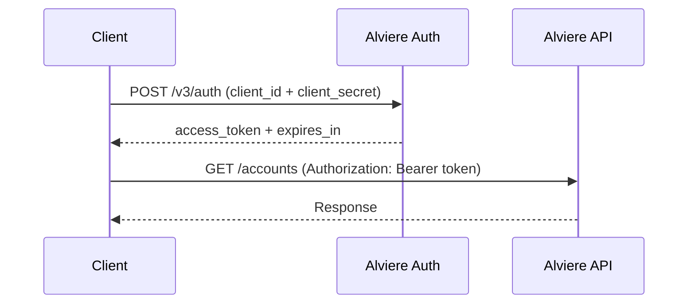

# Authentication

Alviere uses the **OpenID** authentication standard. Every API call needs a valid access token — your first call should always be to the authentication endpoint to get one.

## Get API credentials

Your program manager will give you:

| Credential | Description |
|-----------|-------------|
| `client_id` | Your unique client ID on the Alviere platform |
| `client_secret` | Your API key (you may have more than one) |

:::scalar-callout{type="info"}
Don't have credentials yet? Request them by emailing support@alviere.com from your company email.
:::

## Authentication flow



1. **Get an access token** — call the authentication endpoint first.
2. **Parse the response** — the JWT response includes:
   - `access_token` — the token you'll send on subsequent calls
   - `expires_in` — token lifetime in seconds
3. **Send the token** on every other request:

```bash
curl https://api.snd.alviere.com/accounts \
  -H "Authorization: Bearer YOUR_ACCESS_TOKEN"
```

:::scalar-callout{type="warning"}
Never expose your `client_secret` or access tokens in client-side code or public repositories.
:::
