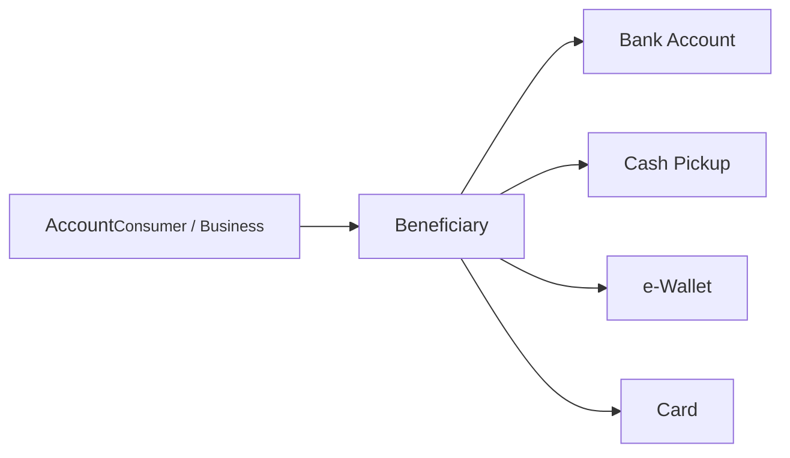

# Beneficiaries & Payouts

A beneficiary is someone (or some entity) designated to receive funds in a domestic or international transaction. Each beneficiary can have multiple payout methods, covering the different ways money can actually reach them: bank accounts, cards, e-wallets, or cash pickup locations.



## Beneficiary types

| Type | Description |
|------|-------------|
| `LOCAL` | Receives funds within the same country and currency. If both parties are on the same Alviere program, you can use P2P transfers |
| `INTERNATIONAL` | Receives funds outside the sender's country, typically with currency conversion (remittance) |

:::scalar-callout{type="info"}
The same person can exist as both a `LOCAL` and `INTERNATIONAL` beneficiary. For example, Jennifer is a `LOCAL` beneficiary when she's in Texas, but a separate `INTERNATIONAL` beneficiary when she's traveling in Mexico and needs funds in pesos.
:::

## Beneficiary statuses

| Status | Description |
|--------|-------------|
| `CREATED` | Record created, validation in progress |
| `PROCESSING` | Undergoing sanctions screening |
| `ACTIVE` | Verified. Funds can be sent |
| `PENDING_USER` | Additional information required from the customer |
| `MANUAL_REVIEW` | Under review by Alviere's compliance team |
| `REJECTED` | Declined by compliance |
| `DELETED` | Removed at the customer's request. **Final** |

**Status reasons**

| Reason | Applicable status | Description |
|--------|-------------------|-------------|
| `STAGE_VALIDATION` | `MANUAL_REVIEW` | Compliance validation failed |
| `INVALID_NAME` | `PENDING_USER` | First or last name is invalid; needs resubmission |
| `SANCTIONED_USER` | `REJECTED` | Rejected due to a sanctions match |
| `CUSTOM` | `REJECTED` | Rejected for non-sanctions reasons |

## Data quality

Incomplete or inaccurate beneficiary data leads to delays or outright rejections, and the data has to match the receiving bank's records, not the customer's memory of them.

There is no single static list of required fields, because requirements change per corridor. Sending USD from the US to MXN in Mexico requires different fields, in different formats, than sending to a bank account in the Philippines. Rather than hardcoding a form per corridor, fetch the requirements:

```bash
curl -G https://api.snd.alviere.com/fx/field-validations \
  -H "Authorization: Bearer $ACCESS_TOKEN" \
  -d origin_country=USA \
  -d origin_currency=USD \
  -d destination_country=MEX \
  -d destination_currency=MXN
```

All four query parameters are required. The response returns four objects, each a JSON Schema fragment you can validate against directly or drive a form from:

| Object | Covers |
|---|---|
| `beneficiary` | Fields needed to create the beneficiary |
| `payout_method` | Fields needed to create their payout method |
| `quote` | Fields needed to request a quote |
| `transaction` | Fields needed to send |

The schemas carry real constraints, not just field names. For a USA/USD → MEX/MXN individual beneficiary, for example, the response specifies `first_name` and `last_name` at 1-40 characters, `date_of_birth` matched against calendar-aware patterns that reject the 31st of a 30-day month, `phone_number` as E.164 (`^\+[1-9]\d{1,14}$`), and a `state` of 2-4 uppercase letters.

:::scalar-callout{type="info"}
Call this at build time for the corridors you support and generate your forms from it, rather than calling it on every page load. Re-check when you add a corridor, since requirements are set by the receiving market and can change without an Alviere release.
:::

Validating client-side against these schemas before you POST is the difference between a customer fixing a typo in the form and a remittance sitting in `MANUAL_REVIEW` for two days.

## Payout methods

Payout methods are the channels through which a beneficiary actually receives funds. They live as child entities of a beneficiary.

### Types

| Type | Description |
|------|-------------|
| **Bank account** | Funds transferred directly to the beneficiary's bank account |
| **Cash pickup** | Beneficiary collects cash at a designated location |
| **e-Wallet** | Funds delivered into a digital wallet |
| **Card** | Funds transferred to the bank account tied to a debit card |
| **Address** | Custom payout location, not limited to supported cash pickup locations |

:::scalar-callout{type="warning"}
Which payout methods are available depends on your program configuration.
:::

### Statuses

| Status | Description |
|--------|-------------|
| `ACTIVE` | Funds can be disbursed through this method |
| `DELETED` | Removed at the customer's request. **Final** |

### Immutability

Account information on a payout method **cannot be changed** after it's created. That's a compliance requirement. The only fields you can update later are:

- `external_id`. Your reference for external systems.
- `label`. Human-readable description.
- `primary`. Whether this is the default payout method for the beneficiary.
