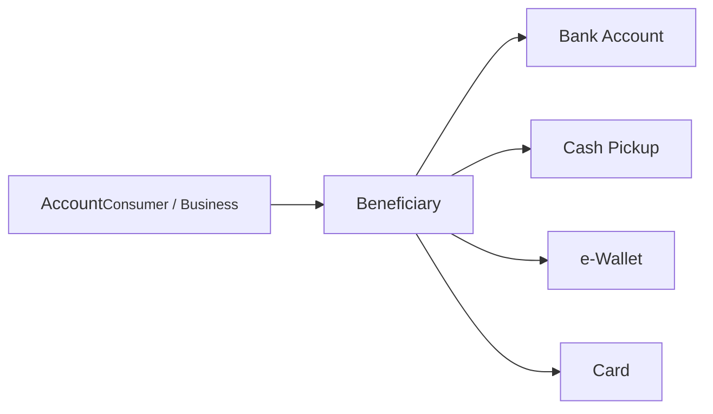

# Beneficiaries & Payouts

A beneficiary is someone (or some entity) designated to receive funds in a domestic or international transaction. Each beneficiary can have multiple payout methods — bank accounts, cards, e-wallets, or cash pickup locations — covering the different ways money can actually reach them.

## Beneficiary types

| Type | Description |
|------|-------------|
| `LOCAL` | Receives funds within the same country and currency. If both parties are on the same Alviere program, you can use P2P transfers |
| `INTERNATIONAL` | Receives funds outside the sender's country, typically with currency conversion (remittance) |

:::scalar-callout{type="info"}
The same person can exist as both a `LOCAL` and `INTERNATIONAL` beneficiary. For example, Jennifer is a `LOCAL` beneficiary when she's in Texas, but a separate `INTERNATIONAL` beneficiary when she's traveling in Mexico and needs funds in pesos.
:::

## Beneficiary statuses

| Status | Description |
|--------|-------------|
| `CREATED` | Record created, validation in progress |
| `PROCESSING` | Undergoing sanctions screening |
| `ACTIVE` | Verified — funds can be sent |
| `PENDING_USER` | Additional information required from the customer |
| `MANUAL_REVIEW` | Under review by Alviere's compliance team |
| `REJECTED` | Declined by compliance |
| `DELETED` | Removed at the customer's request — **final** |

**Status reasons**

| Reason | Applicable status | Description |
|--------|-------------------|-------------|
| `STAGE_VALIDATION` | `MANUAL_REVIEW` | Compliance validation failed |
| `INVALID_NAME` | `PENDING_USER` | First or last name is invalid; needs resubmission |
| `SANCTIONED_USER` | `REJECTED` | Rejected due to a sanctions match |
| `CUSTOM` | `REJECTED` | Rejected for non-sanctions reasons |

## Data quality

Transactions go through validation checks. Incomplete or inaccurate beneficiary data leads to delays or outright rejections — make sure the data you submit matches the receiving bank's records.

:::scalar-callout{type="info"}
A full reference of validation requirements is being expanded — see the [V2 API Reference](/api-v2) for current field constraints.
:::

## Payout methods

Payout methods are the channels through which a beneficiary actually receives funds. They live as child entities of a beneficiary.

### Types

| Type | Description |
|------|-------------|
| **Bank account** | Funds transferred directly to the beneficiary's bank account |
| **Cash pickup** | Beneficiary collects cash at a designated location |
| **e-Wallet** | Funds delivered into a digital wallet |
| **Card** | Funds transferred to the bank account tied to a debit card |
| **Address** | Custom payout location, not limited to supported cash pickup locations |

:::scalar-callout{type="warning"}
Which payout methods are available depends on your program configuration.
:::

### Statuses

| Status | Description |
|--------|-------------|
| `ACTIVE` | Funds can be disbursed through this method |
| `DELETED` | Removed at the customer's request — **final** |

### Immutability

Account information on a payout method **cannot be changed** after it's created — that's a compliance requirement. The only fields you can update later are:

- `external_id` — your reference for external systems
- `label` — human-readable description
- `primary` — whether this is the default payout method for the beneficiary
