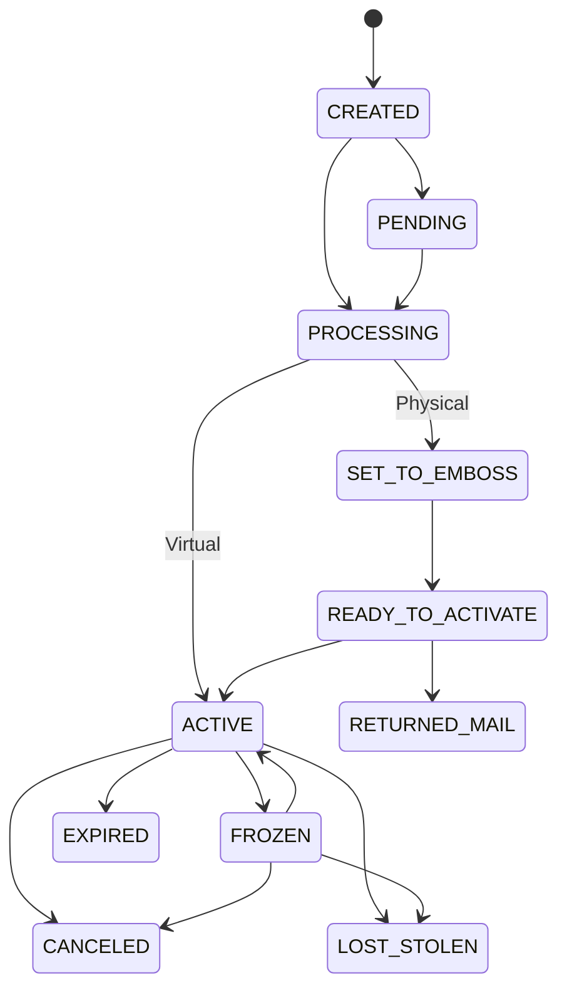

# Issued Cards

An issued card is a debit, prepaid, or gift card you issue to a customer for electronic payments and ATM access. Each card is linked to a wallet. That's where it pulls funds from when the cardholder spends.

## Card types

| Type | Description |
|------|-------------|
| `DEBIT` | Tied directly to wallet funds, debited immediately on purchase |
| `PREPAID` | Preloaded with funds, not linked to a bank account. Can only spend what's loaded |
| `PREPAID_NON_RELOADABLE` | Prepaid card that can't be reloaded once the initial funds are spent |
| `GIFT` | Preloaded with a specific amount, usually not reloadable, often tied to a specific merchant |

## Card lifecycle

## Statuses

| Status | Description |
|--------|-------------|
| `CREATED` | Initial status when the card is created |
| `PENDING` | Awaiting an action from the end customer (e.g. updating shipping address) |
| `PROCESSING` | Card is being processed |
| `ACTIVE` | Card is active and ready for transactions |
| `FROZEN` | All transaction authorizations will be declined |
| `SET_TO_EMBOSS` | Ready to be embossed by the manufacturing partner (physical only) |
| `READY_TO_ACTIVATE` | Ready for activation and PIN setup (physical only) |
| `RETURNED_MAIL` | Returned by the postal service (physical only) |
| `LOST_STOLEN` | Reported lost or stolen by the cardholder. **Final** |
| `CANCELED` | Card has been canceled. **Final** |
| `EXPIRED` | Card has reached its expiration date. **Final** |
