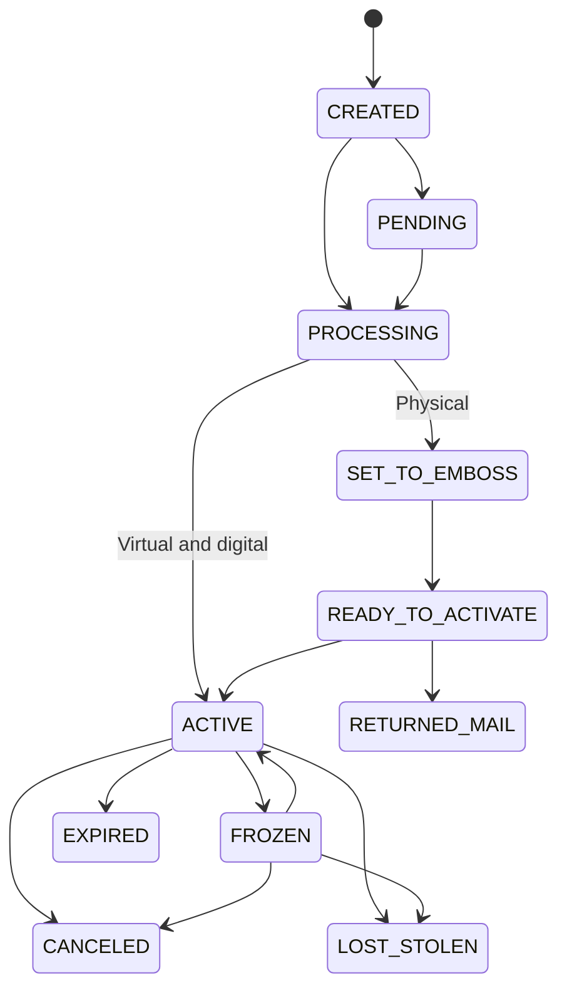

# Issued Cards

An issued card is a branded payment card that spends from a wallet. Creating one takes two required fields; everything else on the request is optional and gated by how your card product is configured.

Read [Card Issuing Overview](/guides/cards/card-issuing-overview) first if you have not yet been given a `product_id`.

## Create a card

```bash
curl -X POST https://api.snd.alviere.com/wallets/{wallet_uuid}/issued-cards \
  -H "Authorization: Bearer $ALVIERE_API_KEY" \
  -H "Version: 2021-11-18" \
  -H "Content-Type: application/json" \
  -d '{
    "external_id": "card-8871-a",
    "product_id": "885"
  }'
```

The wallet comes from the path. There is no `owner` or `wallet_uuid` field in the body, and no way to create a card without naming the wallet it spends from.

```json
{
  "card": {
    "card_uuid": "9fc8c952-9dd5-48a7-a082-f9fee2dd6caa",
    "external_id": "card-8871-a",
    "account_uuid": "86e28f4b-c52d-4498-be89-a890b2298269",
    "wallet_uuid": "01f4746a-a916-418e-8c9f-ecce3260622a",
    "product_id": "885",
    "type": "DEBIT",
    "genre": "VIRTUAL",
    "status": "ACTIVE",
    "status_reason": "",
    "brand": "MASTERCARD",
    "last_4": "5925",
    "card_expiration": "10/27",
    "blocked": false,
    "pin_set": false,
    "auth_rules": {},
    "custom_fields": {},
    "metadata": {},
    "service_fees": [],
    "created_at": "2026-08-29T15:58:26.832Z",
    "updated_at": "2026-08-29T15:58:26.832Z"
  }
}
```

You never get the full card number back from this call. `last_4` is all the create response carries. See [Card Data and PCI](/guides/cards/card-security) for how the PAN is retrieved.

### Required fields

| Field | Notes |
|---|---|
| `external_id` | Your ID for this card. Drives idempotency, see below |
| `product_id` | Assigned by your Alviere program manager. Determines brand, genre, type, and which optional fields are accepted |

### Optional fields

| Field | Use it for | Covered in |
|---|---|---|
| `shipping_address` | Where a physical card is mailed | [Physical Cards](/guides/cards/physical-cards) |
| `custom_fields` | `name_on_card`, `shipping_method`, `carrier_id`, `carrier_message`, `line2_text` | [Physical Cards](/guides/cards/physical-cards) |
| `emboss_id` | Embossing reference for the manufacturer | [Physical Cards](/guides/cards/physical-cards) |
| `initial_balance` | Opening balance, gift products only | [Gift Cards](/guides/cards/gift-cards) |
| `auth_rules.allowed_merchants` | Restricting where the card works | [Merchant Controls](/guides/cards/merchant-controls) |
| `service_fees` | An activation fee deducted from the card | [Gift Cards](/guides/cards/gift-cards) |
| `incentives` | Cashback or boost rules on this card | [Incentives](/guides/cards/incentives) |
| `auto_pin_generation` | Have Alviere generate the PIN instead of prompting the cardholder | [Card Data and PCI](/guides/cards/card-security) |
| `metadata` | Arbitrary keys and values stored with the card. Never used for logic |

Most of these are program-gated. Sending a field your product does not allow returns a `400` configuration error rather than being silently ignored. Look up the `error_code` on [Error Codes](/guides/getting-started/error-codes) if you need to triage which field was disallowed.

### Idempotency

`external_id` must be unique across your program. Retry a create with an `external_id` you have already used and you get a `409`. The body is the card object for the card that already exists, rather than an error envelope:

```json
{
  "card": {
    "card_uuid": "9fc8c952-9dd5-48a7-a082-f9fee2dd6caa",
    "external_id": "card-8871-a",
    "status": "ACTIVE"
  }
}
```

So a `409` on retry is a safe outcome. Read `card_uuid` off it and carry on rather than treating it as a failure. A duplicate caught at validation instead returns a `400`.

## Card lifecycle



Virtual and digital-first cards are created in `ACTIVE` status and are usable straight away. Only physical cards go through embossing and shipping, stopping at `READY_TO_ACTIVATE` until the cardholder activates them. `FAILED` is also a valid status on the card object.

### Statuses

| Status | Description |
|--------|-------------|
| `CREATED` | Initial status when the card is created |
| `PENDING` | Issuance is paused waiting on a correction. Check `status_reason` |
| `PROCESSING` | The card is being issued |
| `ACTIVE` | Card is active and ready for transactions |
| `FROZEN` | All transaction authorizations will be declined |
| `SET_TO_EMBOSS` | Ready to be embossed by the manufacturing partner (physical only) |
| `READY_TO_ACTIVATE` | Ready for activation and PIN setup (physical only) |
| `RETURNED_MAIL` | Returned by the postal service (physical only) |
| `FAILED` | Issuance did not complete. Check `status_reason` |
| `LOST_STOLEN` | Reported lost or stolen by the cardholder. **Final** |
| `CANCELED` | Card has been canceled. **Final** |
| `EXPIRED` | Card has reached its expiration date. **Final** |

### Status reasons

`status_reason` explains why a card is in the status it is in. It is a free-form string rather than an enumerated set, so it is there for a human reading a support ticket, not for your code.

Branch on `status`, which is enumerated and stable. Use `status_reason` to tell an operator or a cardholder what happened. It is empty on most cards.

## List a wallet's cards

```bash
curl -G https://api.snd.alviere.com/wallets/{wallet_uuid}/issued-cards \
  -H "Authorization: Bearer $ALVIERE_API_KEY" \
  -H "Version: 2021-11-18" \
  -d limit=25 \
  -d offset=0
```

Returns `{ "cards": [ … ] }`, each entry the same object as the create response. The list is scoped to one wallet; there is no public endpoint that lists every card in your program at once. To keep your own copy in sync, subscribe to the `ISSUED_CARD` webhook rather than paging this endpoint on a timer.

## Get one card

```bash
curl https://api.snd.alviere.com/wallets/{wallet_uuid}/issued-cards/{card_uuid} \
  -H "Authorization: Bearer $ALVIERE_API_KEY" \
  -H "Version: 2021-11-18"
```

Fields worth knowing on the response beyond the ones shown above:

| Field | Meaning |
|---|---|
| `blocked` | The card is blocked and will decline. Set by a freeze, among other things |
| `frozen` | The card is currently frozen |
| `pin_set` | A PIN exists on this card |
| `converted_to_physical` | This card started virtual and was converted |
| `shipped_at` | When the card was sent to the embossing partner. Not a shipment tracking date, see [Physical Cards](/guides/cards/physical-cards) |
| `incentive_rule_uuids` | Incentive rules attached to this card |
| `initial_balance` | Opening balance in cents. Meaningful on gift products |

## Update a card

`PATCH` is narrow on purpose. You cannot change the product, the type, the genre, the wallet, or `external_id`. Replace the card instead.

| Field | Effect |
|---|---|
| `shipping_address` | New destination for a physical card |
| `metadata` | Replaces your stored keys and values |
| `incentives` | Attaches incentive rules, by `rule_uuids` or inline |
| `physical_card_conversion` | Converts a virtual card to physical. Requires prior approval from Alviere |

```bash
curl -X PATCH https://api.snd.alviere.com/wallets/{wallet_uuid}/issued-cards/{card_uuid} \
  -H "Authorization: Bearer $ALVIERE_API_KEY" \
  -H "Version: 2021-11-18" \
  -H "Content-Type: application/json" \
  -d '{
    "shipping_address": {
      "line_1": "101 Avenue of the Americas",
      "line_2": "Suite 936",
      "city": "New York",
      "state": "NY",
      "postal_code": "10013",
      "country": "USA"
    }
  }'
```

### Recovering a card in PENDING

`PENDING` means issuance is waiting on an action rather than that the card has failed, and the usual action is a corrected shipping address. `PATCH` the card with a valid `shipping_address` and issuance continues. Read `status_reason` to see what is being waited on.

Check `status` on the create response to confirm where the card is.

## Related

- [Card Issuing Overview](/guides/cards/card-issuing-overview). Program setup, genres, types, and the full endpoint map.
- [Card Operations](/guides/cards/card-operations). Activate, freeze, unfreeze, cancel, replace.
- [Physical Cards](/guides/cards/physical-cards). Shipping, embossing, and the returned-mail path.
- [Card Issuance Testing](/guides/sandbox-testing/test-cards). Driving a card through its statuses in Sandbox.
