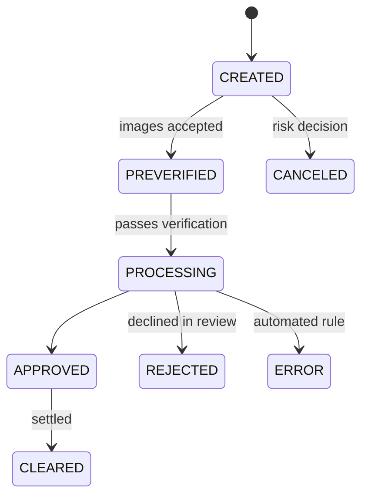

# Checks

A customer photographs the front and back of a check in your app, you send the images and the amount to Alviere, and the deposit posts as a `CHECK_DEPOSIT` transaction on their wallet once it clears. Alviere runs the image checks, the duplicate detection, and the review. Your job is the capture flow and what you tell the customer afterwards.

The Mobile SDKs handle the camera and image quality on iOS and Android. Most rejections are blurry images or a missing endorsement, so coach the customer through the capture before you call the API.

## Deposit a check

```
POST /wallets/{wallet_uuid}/check-deposits
```

```json
{
  "external_id": "chk-2026-00417",
  "front_image": "iVBORw0KGgoAAA...",
  "back_image": "iVBORw0KGgoAAA...",
  "currency": "USD",
  "amount": 25000
}
```

| Field | Notes |
|---|---|
| `external_id` | Your idempotency key. Required |
| `front_image`, `back_image` | Base64 images. The back has to show the endorsement your program requires. Required |
| `currency` | ISO 4217. Required |
| `amount` | In cents. `25000` is $250.00. Alviere reads the amount off the check and compares it to this. Required |
| `service_fees` | Optional. Only `calc_type: DEDUCT` is accepted. The fee comes out of the amount that clears, so the wallet cannot go negative to pay it |

The response is the check with a `status`. Funds land in the wallet's `pending` bucket and move to available balance when the check clears. To make some or all of the amount spendable sooner, see [Early Release of Funds](/guides/transactions/early-release).

## Lifecycle



| Status | What happened |
|--------|-------------|
| `CREATED` | You submitted the check |
| `PREVERIFIED` | The images passed the first automated checks |
| `PROCESSING` | Alviere is verifying the check and preparing it for settlement |
| `APPROVED` | Accepted. Waiting for the funds to settle |
| `CLEARED` | Settled. The funds are available. Final |
| `ERROR` | An automated rule stopped it. Read `status_reason`. Final for this submission, and often fixable with a new photo |
| `REJECTED` | A reviewer declined it. Read `rejected_reasons`. Final |
| `CANCELED` | Alviere's risk team canceled it based on account behavior. Final |

## Error reasons

For a check in `ERROR`, `status_reason` says what the automated rule caught. The split that matters is whether the customer can fix it by recapturing, or whether the deposit is dead.

**Recapturable. Send the customer back to the camera.**

| Value | What went wrong |
|---|---|
| `FRONT_IMAGE` | The front image failed verification |
| `BACK_IMAGE` | The back image failed verification, most often a missing endorsement |
| `FRONT_BACK_IMAGE` | Both images failed |
| `AMOUNT` | The amount read off the check does not match what you submitted |

**Not recapturable. Do not prompt for another photo.**

| Value | What went wrong |
|---|---|
| `INTERNAL_DUPLICATE` | This check was already deposited on your program |
| `EXTERNAL_DUPLICATE` | This check was already deposited somewhere else |
| `INVALID_DOCUMENT` | The image is not a check |
| `INVALID_DATA` | The submitted data failed validation |
| `BLACKLIST` | The check or the payor is blocked |
| `SYSTEM` | An internal processing failure. Retry once, then escalate |
| `OTHER` | Unclassified. Escalate to support |

:::scalar-callout{type="warning"}
Both duplicate reasons are a fraud signal, not a user error. Re-prompting for a photo on `INTERNAL_DUPLICATE` or `EXTERNAL_DUPLICATE` invites the customer to try again on a check that has already been paid.
:::

## Rejection reasons

A check in `REJECTED` was declined by a reviewer rather than by an automated rule. Two fields carry the outcome.

| Field | Contents |
|---|---|
| `rejected_reasons` | An array of reason strings. Free-form, not a fixed enum |
| `rejected_reasons_description` | An array of explanations written by the reviewer |

Neither field is enumerated, so do not branch application logic on their contents and do not show them to the customer verbatim. Treat `REJECTED` as final for that deposit, tell the customer the deposit could not be accepted, and route the reason strings to your support queue where a person reads them.

`ERROR` and `REJECTED` are not interchangeable. `ERROR` came from an automated rule and often means recapture. `REJECTED` came from a person and never does.

## Related

- [Early Release of Funds](/guides/transactions/early-release). Make deposited funds spendable before they clear.
- [Wallets](/guides/resources/wallets). The `pending` bucket where deposits wait.
- [Transactions Overview](/guides/transactions/transactions-overview). `CHECK_DEPOSIT` and `CHECK_DEPOSIT_RETURN`.
- [Webhooks](/guides/more/webhooks). Subscribe to `WALLET_TRANSACTION` for the clear.
