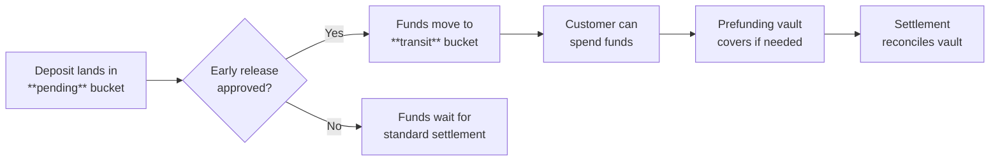

# Early Release of Funds

Mobile check and ACH deposits normally follow the "good funds" model — there's a waiting period before settlement clears. That's safer against fraud, but it leaves customers waiting on money they need to spend.

The Early Release of Funds feature lets you release deposited funds early, using your own business rules to decide who gets early access and how much.

## How it works



1. **Deposit arrives.** Funds from check deposits and ACH loads land in the wallet's `pending` bucket.
2. **Early release approved.** The released amount moves from `pending` to `transit`.
3. **Funds available.** Transit funds are spendable.
4. **Prefunding covers gaps.** If `balance` can't cover a transaction, the prefunding treasury vault provides temporary coverage.
5. **Settlement reconciles.** When the original funds settle, any prefunding coverage is reconciled.

:::scalar-callout{type="info"}
Fund movement between buckets is automated — the wallet updates in real time.
:::

## API integration

Send a `POST` to `/transactions/release`:

```json
POST /transactions/release

{
  "external_id": "1AS245CHK",
  "transaction_uuid": "3a6bcbed-b7dc-4791-84fe-b20f12be4001",
  "release_amount": 1000,
  "service_fees": [
    {
      "external_id": "string",
      "description": "string",
      "calc_type": "DEDUCT",
      "category": {
        "release_fee": {
          "value": {
            "amount": 1000
          }
        }
      }
    }
  ]
}
```

### Parameters

| Parameter | Description |
|-----------|-------------|
| `external_id` | Your unique identifier for the transaction |
| `transaction_uuid` | UUID of the original deposit transaction |
| `release_amount` | Amount to release early, in the smallest currency unit (e.g. cents for USD) |
| `service_fees` | Optional array of service fee objects |

### Service fee object

| Field | Description |
|-------|-------------|
| `external_id` | Identifier for the service fee |
| `description` | Brief description of the fee |
| `calc_type` | Calculation type — only `DEDUCT` is supported for releases |
| `category` | Fee category — only `release_fee` with its value is supported for releases |

## Deciding when to release

Whether to release funds early is a risk decision. Two key inputs help you make it: **funding instruments** and **transactional history**.

### Funding instruments

Funding instruments represent the bank account or financial source behind a deposit (the check or ACH source). The transaction's `funds_source` includes a `funding_instrument_details` object:

| Field | Description |
|-------|-------------|
| `funding_instrument_uuid` | Unique token identifying the funding source. Shared across all programs on Alviere, so you can leverage cross-program fraud intelligence. Created the first time a new payor is identified. |
| `bank_account_details` | Routing and bank account numbers — lets you identify transactions from known, trusted bank accounts |

### Transactional history

The _Calculate transactional summary data_ endpoint gives you historical signal by `account_uuid` or `funding_instrument_uuid`:

- Number of returned transactions
- Completed and failed transaction counts
- Total and average returned value

### Suggested decision criteria

| Criteria | Signal | Suggested action |
|----------|--------|-----------------|
| **Trusted funding instrument** | Known UUID with clean history across programs | Instant release |
| **Known third-party payor** | Verified bank account of a trusted employer or institution | Favorable release terms |
| **Strong transactional history** | Low return rate, high completion rate | Accelerated release |
| **New or unknown instrument** | No history, first-time payor | Standard settlement wait |
| **High return rate** | Elevated returned transaction count or value | Deny early release |
