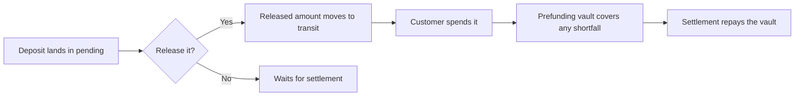

# Early Release of Funds

A check deposit or an ACH load sits in the wallet's `pending` bucket until it settles, which protects you from returns but leaves the customer waiting on money they can see. Early release lets you make some or all of a pending deposit spendable now. You decide who qualifies and for how much. Alviere moves the funds and covers the gap until settlement.

## How it works



You call the release endpoint against the deposit transaction with the amount to free up. That amount moves from `pending` to `transit` and becomes spendable. If the customer spends it before the deposit settles, the program's prefunding vault covers the difference, and settlement repays the vault. If the deposit later returns, the loss is on the program, which is why the decision is yours.

## Release funds

```
POST /transactions/release
```

```json
{
  "external_id": "rel-2026-00417",
  "transaction_uuid": "3a6bcbed-b7dc-4791-84fe-b20f12be4001",
  "release_amount": 10000,
  "service_fees": [
    {
      "external_id": "relfee-2026-00417",
      "description": "Instant availability fee",
      "calc_type": "DEDUCT",
      "category": {
        "release_fee": {
          "value": { "amount": 1000 }
        }
      }
    }
  ]
}
```

| Field | Notes |
|---|---|
| `external_id` | Your idempotency key for the release. Required |
| `transaction_uuid` | The deposit to release from. Required |
| `release_amount` | In cents, up to the pending amount. Required |
| `service_fees` | Optional. A fee for the early access, deducted from the released amount. Only `calc_type: DEDUCT` and the `release_fee` category are accepted |

A release of less than the full deposit leaves the rest in `pending` on the normal schedule.

## Deciding whether to release

Two signals on the deposit tell you how much to trust it.

**Who paid.** The transaction's `funds_source.funding_instrument_details` identifies the bank account behind the check or the ACH load. `funding_instrument_uuid` is a token for that account, created the first time Alviere sees it and shared across every program on Alviere, so a payor with a clean history on another program arrives with that history on yours. `bank_account_details` carries the routing and account numbers, which lets you recognize a known employer or institution.

**How they have behaved.** `GET /transactions/summary-data` returns, for an `account_uuid` or a `funding_instrument_uuid`, the count of returned transactions, the counts of completed and failed transactions, and the total and average returned value.

From those, a rule set most programs converge on. Release in full for a funding instrument with a clean history and for verified accounts of known payors such as employers. Release in full or with a short delay for a customer with a low return rate and high completion rate. Hold a first-time payor with no history for the standard settlement wait. Deny early release when returned count or value is elevated. Charge a `release_fee` where your program prices the convenience.

## Related

- [Checks](/guides/transactions/checks). The deposit that most releases act on.
- [ACH](/guides/transactions/ach). Pulls that can also be released early.
- [Wallets](/guides/resources/wallets). The `pending` and `transit` buckets.
- [Transactions Overview](/guides/transactions/transactions-overview). `PREFUND` and the return types.
