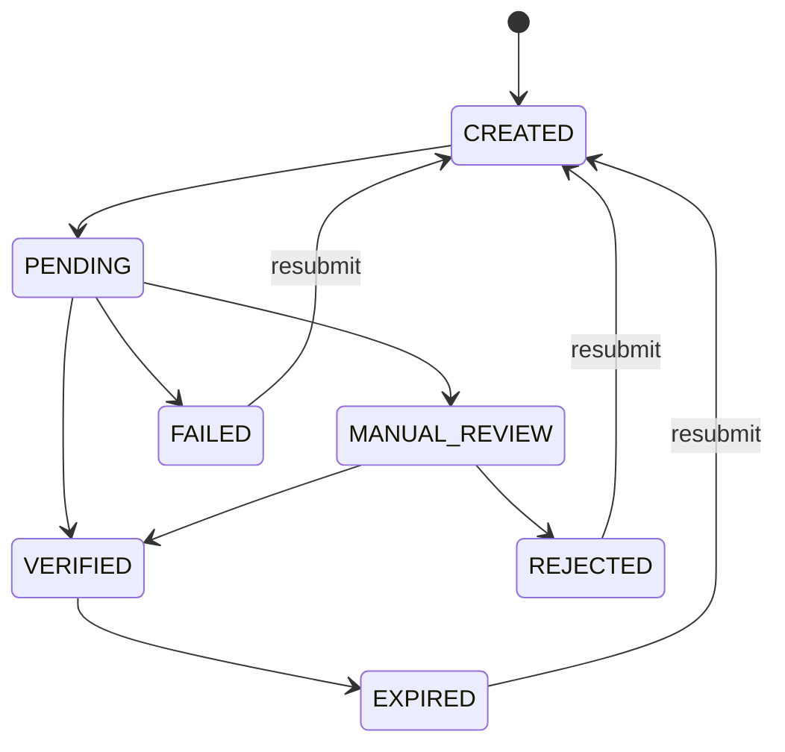

# Identity (Dossier)

A dossier is how you collect and verify the documents that prove a customer's identity, address, or business standing. That's the KYC and KYB part of onboarding. Every dossier is attached to an account (consumer, business, or stakeholder).

## Lifecycle

| Status | Description |
|--------|-------------|
| `CREATED` | Dossier submitted via API |
| `PENDING` | Under verification |
| `MANUAL_REVIEW` | Requires manual verification by compliance |
| `VERIFIED` | Approved. Identity confirmed |
| `REJECTED` | Denied (inauthentic documents, poor quality, etc.) |
| `FAILED` | Verification failed due to invalid document formats |
| `EXPIRED` | Document has passed its valid date. The account reverts to `PENDING_USER` for resubmission |
| `DELETED` | Removed from the system |

## Document types

:::scalar-callout{type="info"}
The full reference of supported document types is being expanded. See the [V2 API Reference](/api-v2) for the current list and per-type requirements.
:::

## Creating a dossier

Create a dossier by passing the account UUID it belongs to. You can mark it as `primary` to flag it as containing the essential onboarding documents for the account.

**Eligible account statuses:** `CREATED`, `PENDING_USER`, `ACTIVE`

:::scalar-callout{type="warning"}
For stakeholder accounts, the parent business account can't be in `INACTIVE`, `DELETED`, or `REJECTED` status.
:::

## Updating a dossier

When verification fails, you have two options:

1. **Update a single document**. Replace just the document that failed.
2. **Replace the entire dossier**. Submit a complete new set.

Updates are only allowed when **all** these conditions are met:

| Condition | Required values |
|-----------|----------------|
| Account status | `CREATED` or `PENDING_USER` (in `DOCUMENTS` stage) |
| Dossier status | `EXPIRED`, `REJECTED`, or `FAILED` |
| Parent business (stakeholders only) | Not `INACTIVE`, `DELETED`, or `REJECTED` |

## Real-time verification

Set `real_time_verification` when creating a dossier to get immediate feedback on uploaded documents, useful when you don't want to wait for the async verification that runs after all KYC stages complete.

| Outcome | Dossier status | Details |
|---------|---------------|---------|
| Success | `VERIFIED` | Documents meet all criteria |
| Failure | `FAILED` | Each document includes a `fail_reasons` array with specific issues |

:::scalar-callout{type="info"}
Not every document type supports real-time verification. Check with your Alviere program manager for eligibility.
:::

## Document fail reasons

:::scalar-callout{type="info"}
The full reference of document `fail_reasons` values is being expanded. See the [V2 API Reference](/api-v2) for the current list.
:::
