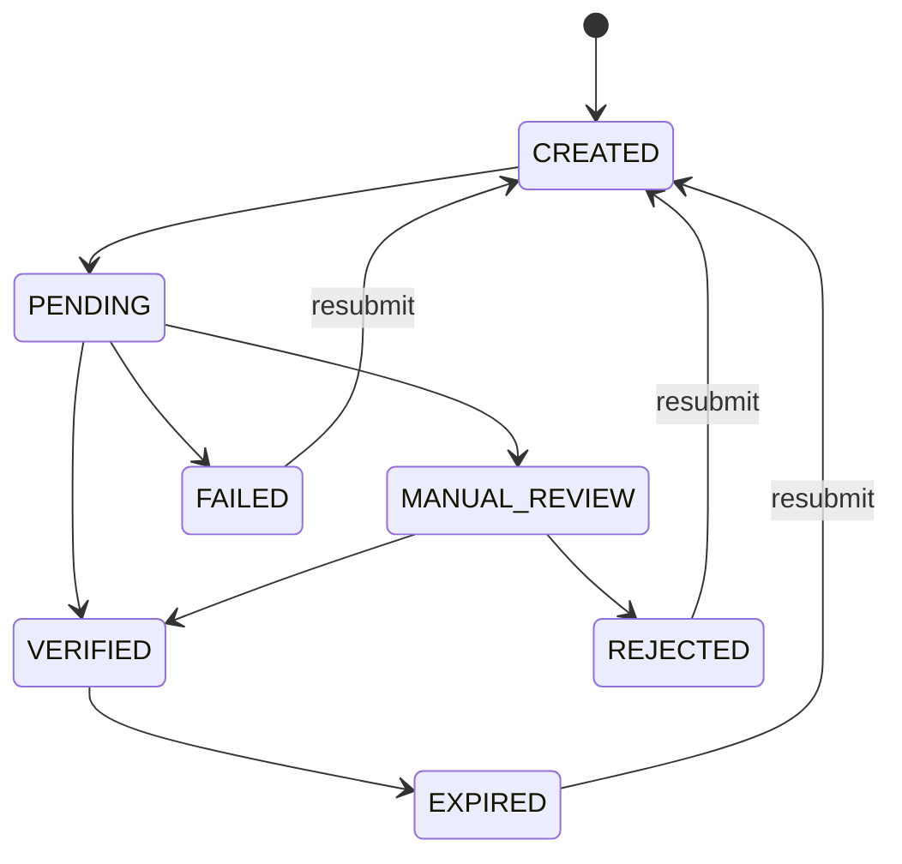

# Identity (Dossier)

A dossier is how you collect and verify the documents that prove a customer's identity, address, or business standing. That's the KYC and KYB part of onboarding. Every dossier is attached to an account (consumer, business, or stakeholder).

## Lifecycle

| Status | Description |
|--------|-------------|
| `CREATED` | Dossier submitted via API |
| `PENDING` | Under verification |
| `MANUAL_REVIEW` | Requires manual verification by compliance |
| `VERIFIED` | Approved. Identity confirmed |
| `REJECTED` | Denied (inauthentic documents, poor quality, etc.) |
| `FAILED` | Verification failed due to invalid document formats |
| `EXPIRED` | Document has passed its valid date. The account reverts to `PENDING_USER` for resubmission |
| `DELETED` | Removed from the system |

## Document types

Each document in a dossier carries a `type`. Which ones you need depends on the profile the account is applying for, so check your program configuration before building the upload UI.

**Consumer identity**

| Type | Notes |
|---|---|
| `PASSPORT` | Single image |
| `ID_DOCUMENT_FRONT` / `ID_DOCUMENT_BACK` | Government ID, both sides required |
| `DRIVER_LICENSE_FRONT` / `DRIVER_LICENSE_BACK` | Both sides required |
| `INE_FRONT` / `INE_BACK` | Mexican national voter ID, both sides required |
| `MC_DOCUMENT_FRONT` / `MC_DOCUMENT_BACK` | Mexican consular ID, both sides required |
| `SELFIE` | Used for liveness and face match against the ID |

**Supporting evidence**

| Type | Notes |
|---|---|
| `PROOF_OF_ADDRESS` | Usually a utility bill or bank statement |
| `PROOF_OF_FUNDS` | Source-of-funds evidence, typically requested at higher profiles |

**Business (KYB)**

| Type | Notes |
|---|---|
| `ARTICLES_OF_INCORPORATION` | Formation document |
| `CERTIFICATE_OF_GOOD_STANDING` | Issued by the state of incorporation |
| `ORG_CHART` | Ownership structure |
| `UBO_FORM` | Ultimate beneficial ownership declaration |
| `REG_GG_ATTESTATION` | Regulation GG attestation (unlawful internet gambling) |

:::scalar-callout{type="warning"}
The two-sided types are genuinely two documents. Uploading `ID_DOCUMENT_FRONT` without `ID_DOCUMENT_BACK` leaves the dossier incomplete and it will not move out of `PENDING`.
:::

Each document also carries `extracted_data`, populated by OCR: `given_name`, `last_name`, `date_of_birth`, and an `address` object. Compare it against what the customer typed to catch transcription errors before verification rejects them.

Documents come back base64-encoded in `file`, but only from `GET /accounts/{account_uuid}/dossiers/{dossier_uuid}`. List responses omit it.

## Creating a dossier

Create a dossier by passing the account UUID it belongs to. You can mark it as `primary` to flag it as containing the essential onboarding documents for the account.

**Eligible account statuses:** `CREATED`, `PENDING_USER`, `ACTIVE`

:::scalar-callout{type="warning"}
For stakeholder accounts, the parent business account can't be in `INACTIVE`, `DELETED`, or `REJECTED` status.
:::

## Updating a dossier

When verification fails, you have two options:

1. **Update a single document**. Replace just the document that failed.
2. **Replace the entire dossier**. Submit a complete new set.

Updates are only allowed when **all** these conditions are met:

| Condition | Required values |
|-----------|----------------|
| Account status | `CREATED` or `PENDING_USER` (in `DOCUMENTS` stage) |
| Dossier status | `EXPIRED`, `REJECTED`, or `FAILED` |
| Parent business (stakeholders only) | Not `INACTIVE`, `DELETED`, or `REJECTED` |

## Real-time verification

Set `real_time_verification` when creating a dossier to get immediate feedback on uploaded documents, useful when you don't want to wait for the async verification that runs after all KYC stages complete.

| Outcome | Dossier status | Details |
|---------|---------------|---------|
| Success | `VERIFIED` | Documents meet all criteria |
| Failure | `FAILED` | Each document includes a `fail_reasons` array with specific issues |

:::scalar-callout{type="info"}
Not every document type supports real-time verification. Check with your Alviere program manager for eligibility.
:::

## Document fail reasons

When a document fails verification, that document's `fail_reasons` array carries the reasons. It is a free-form list written by the verification provider, not a fixed enum, so do not switch on its contents or show it to the customer verbatim.

Drive your UI off the **account's** `status_reason` instead. That field is enumerated and names exactly which document to recapture (`REQUIRES_DRIVERS_LICENSE_BACK_RESUBMISSION`, `REQUIRES_SELFIE_RESUBMISSION`, and so on). See [Status reasons](/guides/resources/accounts#status-reasons) for the full list and what to ask for on each.

Use `fail_reasons` for your support tooling and logs, where a human reads it.
