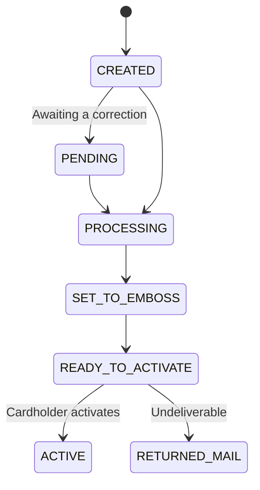

# Physical Cards

A physical card is the same entity as a virtual one, with a manufacturing and delivery stage in front of it. That stage uses fields you never touch on a virtual card, and it is worth getting right first time.

Genre is set by the card product. You do not ask for a physical card on the request; you use a `product_id` whose genre is `PHYSICAL`.

## The fulfilment path



| Status | What it means for fulfilment |
|---|---|
| `PENDING` | Awaiting an action from the end customer, such as correcting the shipping address |
| `PROCESSING` | The card is being processed |
| `SET_TO_EMBOSS` | Ready to be embossed by the manufacturing partner |
| `READY_TO_ACTIVATE` | Ready for the cardholder to activate. A PIN can only be set after that |
| `RETURNED_MAIL` | Returned by the postal service |

The card is not spendable until the cardholder activates it. See [Card Operations](/guides/cards/card-operations).

## Shipping address

A card whose shipping address needs attention is created in `PENDING` rather than being rejected, so the card is still yours to correct. Check `status` on the create response, and read `status_reason` for what it is waiting on.

```json
{
  "shipping_address": {
    "line_1": "101 Avenue of the Americas",
    "line_2": "Suite 936",
    "city": "New York",
    "state": "NY",
    "postal_code": "10013",
    "country": "USA"
  }
}
```

Alviere ships to any valid US address, including these associated territories:

| Code | Territory |
|---|---|
| `AS` | American Samoa |
| `GU` | Guam |
| `MP` | Northern Mariana Islands |
| `PR` | Puerto Rico |
| `VI` | Virgin Islands |

Pass the territory code in `state`, exactly as you would a state code, with `USA` in `country`.

| Field | Required | Format |
|---|---|---|
| `line_1` | Yes | 2-40 characters, no newlines |
| `line_2` | No | 1-30 characters, no newlines |
| `city` | Yes | 2-128 characters |
| `state` | Yes | Two uppercase letters |
| `postal_code` | Yes | 5-9 characters |
| `country` | Yes | Three-letter ISO 3166-1 alpha-3 code, e.g. `USA` |

`country` is alpha-3, not the alpha-2 code most address forms collect. `US` is rejected; `USA` is correct.

To release a card from `PENDING`, `PATCH` it with a valid address. Issuance continues from there. You do not create a second card.

A card with no address at all cannot be shipped or replaced, and an address that fails validation, both return a `400` validation error.

## Embossing and the carrier

`custom_fields` carries what gets printed, and `emboss_id` identifies the job to the manufacturer.

```json
{
  "external_id": "card-9034-a",
  "product_id": "885",
  "emboss_id": "EMB-44192",
  "shipping_address": { "…": "…" },
  "custom_fields": {
    "name_on_card": "John Doe",
    "line2_text": "ACCT 12345",
    "shipping_method": "EXPRESS_FEDEX",
    "carrier_id": "CARRIER-7",
    "carrier_message": "Welcome. Activate your card at example.com/activate"
  }
}
```

| Field | Limits | Notes |
|---|---|---|
| `name_on_card` | 2-26 characters, letters, digits, spaces, hyphens | The product may cap it shorter than 26 |
| `line2_text` | 1-26 characters, same character set | Second embossed line |
| `shipping_method` | `DEFAULT` or `EXPRESS_FEDEX` | |
| `carrier_id` | Up to 30 characters | Identifies the carrier insert the card is mounted on |
| `carrier_message` | 1-150 characters | Printed on the insert, not on the card |
| `emboss_id` | Program-defined | Required by some products, forbidden by others |

Every one of these is gated by your card product, and a `400` validation error tells you which way a product is configured rather than that your request was malformed:

- The product requires `emboss_id` but it is not configured
- `emboss_id` is required and was not sent
- `emboss_id` is not valid
- This product does not allow `shipping_method`
- `name_on_card` is longer than the product allows
- `name_on_card` contains characters that cannot be embossed
- The product's name length is not configured
- The product requires `carrier_id` but it is not configured
- `carrier_id` is required and was not sent
- `carrier_id` cannot be sent for this product
- `carrier_message` is not usable for this card genre
- `carrier_message` is not usable for this card type

Whether `carrier_id` is required or forbidden is a property of the product. Do not send it unconditionally — check what your `product_id` allows.

## Knowing where a card is

There is no shipment tracking. Alviere does not currently receive a reliable shipped-at timestamp from the shipping provider, so nothing in the API tells you when a card entered the mail or where it is now.

`shipped_at` on the card object is the closest signal, and it is not what its name suggests: it records when the card was **sent to the embossing partner**, not when it was posted to the cardholder. Use it to confirm the card entered manufacturing. Do not show it to a cardholder as a dispatch date, and do not build a delivery estimate on it.

What you do get is the status. `READY_TO_ACTIVATE` means the card has left manufacturing and the cardholder can activate it once it arrives; `RETURNED_MAIL` means it came back. Between those two, the honest answer to "where is my card" is that it is in the mail.

## Get the card image

Returns a base64 image of the physical card, so you can show the cardholder the card they are waiting for rather than a generic graphic.

```bash
curl https://api.snd.alviere.com/wallets/{wallet_uuid}/issued-cards/{card_uuid}/image \
  -H "Authorization: Bearer $ALVIERE_API_KEY" \
  -H "Version: 2021-11-18"
```

```json
{
  "card_image": "U3dhZ2dlciByb2Nrcw=="
}
```

The image shows the card art. It is not sensitive data and carries no PAN, so it is safe to render in your own app. Retrieving the actual card number is a different endpoint with different rules. See [Card Data and PCI](/guides/cards/card-security).

## Returned mail

A card that comes back undelivered lands in `RETURNED_MAIL`. The cardholder never had it, so nothing has been compromised and there is no urgency beyond getting the address right.

`PATCH` the card with a corrected `shipping_address` to send another one.

You can simulate returned mail in Sandbox with specific test addresses. See [Card Issuance Testing](/guides/sandbox-testing/test-cards).

## Converting a virtual card to physical

A cardholder who has been using a virtual card can be sent a plastic one without losing the card they already have set up. This requires prior approval from Alviere for your program.

```bash
curl -X PATCH https://api.snd.alviere.com/wallets/{wallet_uuid}/issued-cards/{card_uuid} \
  -H "Authorization: Bearer $ALVIERE_API_KEY" \
  -H "Version: 2021-11-18" \
  -H "Content-Type: application/json" \
  -d '{
    "physical_card_conversion": {
      "product_id": "886",
      "custom_fields": {
        "name_on_card": "John Doe",
        "shipping_method": "DEFAULT"
      }
    }
  }'
```

`product_id` here is the **physical** product, which is a different ID from the virtual one the card was created with. `converted_to_physical` on the card object marks a card that started virtual and was converted.

## Related

- [Issued Cards](/guides/cards/cards). Creating cards and recovering from `PENDING`.
- [Card Operations](/guides/cards/card-operations). Activating the card once it arrives.
- [Card Issuance Testing](/guides/sandbox-testing/test-cards). Simulating shipping and returned mail.
