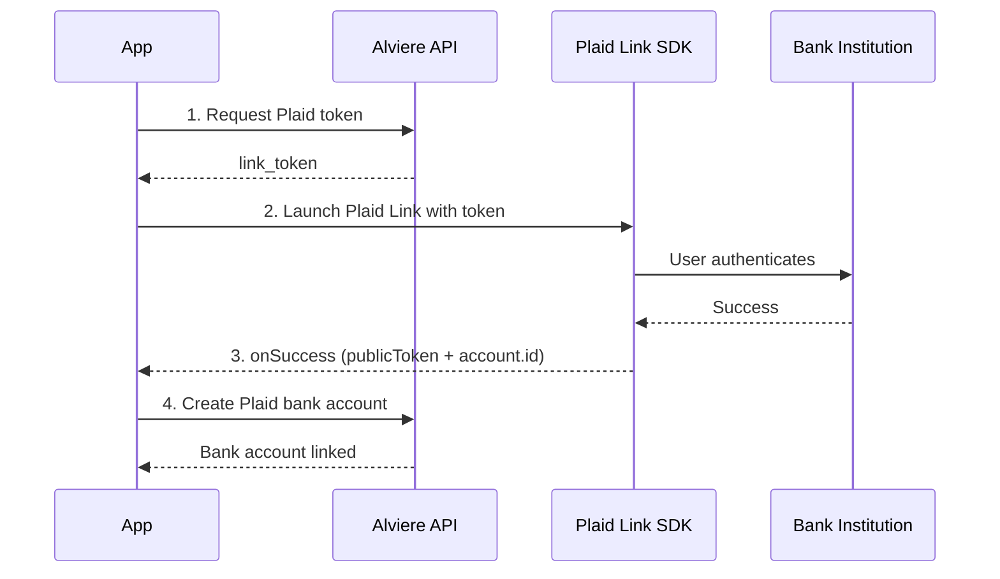
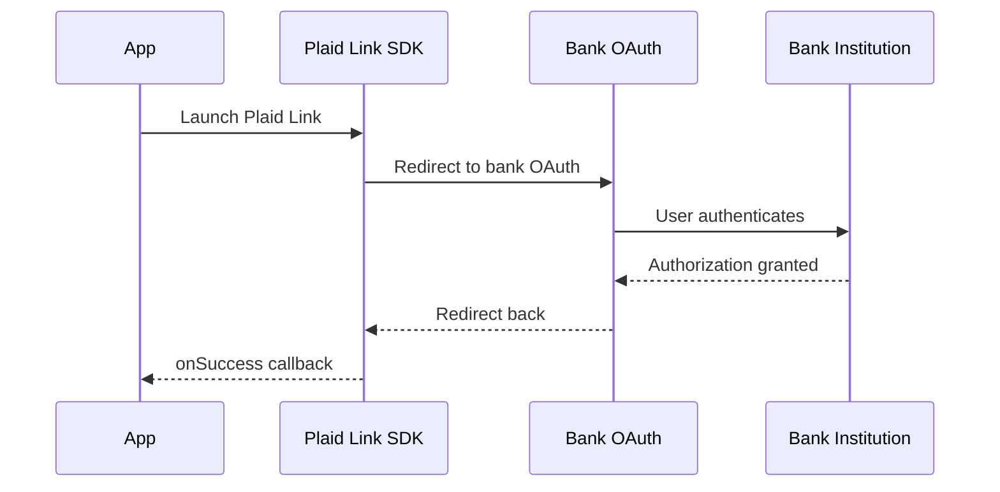
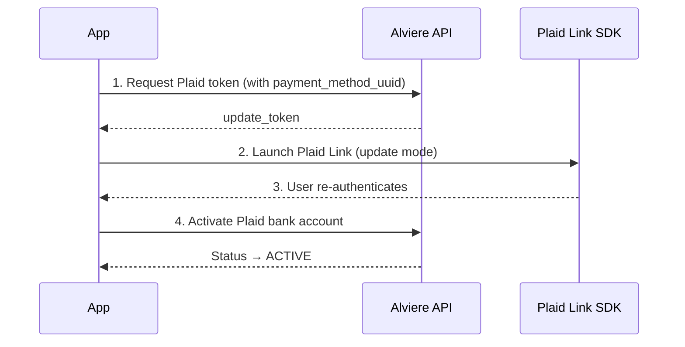

# Plaid Integration

Plaid Link lets your users securely connect their bank account to your app. It's a drop-in SDK that handles credential validation, multi-factor auth, and error handling. You never see the sensitive credentials, only a tokenized result.

Alviere brokers the token exchange so the linked bank account ends up as a payment method on the customer's Alviere account, ready to debit or credit.

## Setup

Before writing code, register your app with Plaid through Alviere and configure your project.

### Web

1. Create a **redirect URI**, a blank web page you host (e.g. `https://example.com/oauth-page.html`) that lets users resume Link after completing OAuth on their bank's site
2. Hand the redirect URI to your Alviere representative for configuration
3. Integrate Plaid Link using the [vanilla JavaScript](https://plaid.com/docs/link/web/#installation) or [React](https://plaid.com/docs/link/web/#installation) library

### iOS

1. Set up **universal links** for your app. Plaid uses these for OAuth-based banks
2. Specify a Plaid path (e.g. `https://app.example.com/plaid`). See [Plaid's universal links docs](https://plaid.com/docs/link/ios/#set-up-universal-links) if you don't have universal links yet.
3. Hand the universal link path to your Alviere representative
4. Install the Plaid Link SDK via SPM, CocoaPods, or manually. See [Plaid iOS docs](https://plaid.com/docs/link/ios/#installation)

:::scalar-callout{type="info"}
Skip the camera support step. Alviere doesn't have it enabled.
:::

### Android

1. Hand your **app package name** to your Alviere representative
2. Install the Plaid Link SDK via Maven. See [Plaid Android docs](https://plaid.com/docs/link/android/#add-the-plaidlink-sdk-to-your-app)

:::scalar-callout{type="info"}
Skip the identity verification step. Alviere doesn't have it enabled.
:::

### React Native

Do the platform-specific setup first:

- **iOS**. Configure universal links (see iOS section above), hand the link to Alviere.
- **Android**. Hand your app package name to Alviere.

Then install the SDK following the [iOS setup](https://plaid.com/docs/link/react-native/ios-setup/#ios-setup) and [Android setup](https://plaid.com/docs/link/react-native/android-setup/#add-plaidpackage-to-your-application) guides.

## Linking an account

### Steps

1. **Get a Plaid token.** Request a fresh token from the Alviere API. That's the only thing you need to launch Plaid Link.

2. **Launch Plaid Link.** Open the SDK with the token. Per-platform docs:
   - [Web](https://plaid.com/docs/link/web/#create)
   - [iOS](https://plaid.com/docs/link/ios/#create-a-configuration)
   - [Android](https://plaid.com/docs/link/android/#create-a-linktokenconfiguration)
   - [React Native](https://plaid.com/docs/link/react-native/#plaidlink)

3. **Capture the callback.** On `onSuccess`, capture `result.publicToken` and `result.account.id`.

4. **Link the account.** Use those values to create a Plaid bank account on Alviere via:
   - The Alviere API directly
   - [iOS Payments SDK](https://developer.alviere.com/sdk/ios/payments/#create-plaid-bank-account)
   - [Android Payments SDK](https://developer.alviere.com/sdk/android/payments/#create-plaid-bank-account)

### OAuth flow

Some banks (Chase, for example) require OAuth, which temporarily sends users to the bank's website or app. The Plaid Link SDK manages this redirect for you. No extra setup needed.

The token request and bank account linking steps are the same as the standard flow.

## Updating an account

Update mode handles re-authentication when access to a linked bank stops working: after a password change, an MFA reset, an account lock, and so on.

On Alviere, this shows up as a bank with status `PENDING` and `status_reason` `NEEDS_UPDATE`.

### Steps

1. **Request a Plaid token.** Same endpoint as linking, but pass the `payment_method_uuid` of the bank account that needs updating. The returned token is an update token.

2. **Launch Plaid Link.** The SDK automatically enters update mode when given an update token.

3. **User re-authenticates.** The user completes re-authentication through the Plaid Link UI.

4. **Notify Alviere.** Call the activate endpoint via:
   - The Alviere API directly
   - [iOS Payments SDK](https://developer.alviere.com/sdk/ios/payments/#activate-plaid-bank-account)
   - [Android Payments SDK](https://developer.alviere.com/sdk/android/payments/#activate-plaid-bank-account)

After this, the bank account status goes back to `ACTIVE`.

## Testing

The Alviere Sandbox is compatible with the Plaid Sandbox. Use [Plaid's test credentials](https://plaid.com/docs/sandbox/test-credentials/) to simulate bank linking scenarios in your app before promoting to production.
