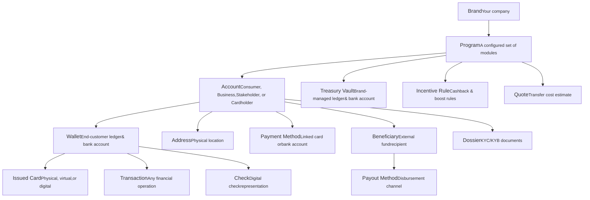

# Platform Overview

The HIVE Platform organizes everything around three ideas: **Programs** (the contract between your company and Alviere), **Modules** (the financial features turned on for a program), and **Entities** (the API objects you'll work with: accounts, wallets, cards, transactions, and so on).

## Programs

A program is how the relationship between your company (the "Brand") and Alviere is represented in the system. You can run multiple programs under one brand, each configured for a different financial offering.

Each program has its own:

- Transaction limits
- Card customization
- Service fees
- KYC/KYB requirements
- Fraud prevention and compliance rules

:::scalar-callout{type="info"}
Every account belongs to exactly one program. Data is never shared across programs, even within the same brand. Your Alviere program manager configures the program.
:::

## Modules

Modules are clusters of features that deliver a specific financial service. Your program is built by enabling the modules you need:

| Module | What it covers |
|--------|-------------|
| **Accounts** | Consumer and business account creation, management, and reporting |
| **Payments** | Card and bank processing, check deposits, P2P transfers, and more |
| **Branded Cards** | Physical, virtual, or digital cards (debit, credit, prepaid) with custom branding and real-time monitoring |
| **Security, Risk & Compliance** | AML checks, KYC/KYB verification, and fraud detection |
| **Global Money Transfers** | International remittance, currency conversion, cash pickup |
| **Portal** | Admin interface for managing accounts, transactions, and program settings |
| **Business Intelligence & Data** | Analytics, reporting, trend analysis, and financial reconciliation |

## Entity hierarchy

Every object in HIVE has one parent. The map below tells you which UUID you need before you can create or query an entity.

## Entities reference

| Entity | Description | Parent |
|--------|-------------|--------|
| **Brand** | Your company or legal entity using the HIVE Platform | — |
| **Program** | A configured set of modules delivering financial services to your end customers | Brand |
| **Account** | An end customer (Consumer, Business, Stakeholder, or Cardholder) | Program |
| **Treasury Vault** | A brand-managed ledger and bank account that powers fund flows for a program | Program |
| **Wallet** | A ledger that captures transactional activity and available funds for an end customer | Account |
| **Issued Card** | A physical, virtual, or digital card issued to an end customer | Wallet |
| **Address** | A physical location associated with an account for validation, contact, or shipping | Account |
| **Payment Method** | A linked card or bank account used to load or withdraw funds | Account |
| **Beneficiary** | An external individual or entity receiving funds in a transaction | Account |
| **Transaction** | A record of any financial operation (transfer, payment, etc.) | Wallet |
| **Check** | A digital representation of a physical check | Wallet |
| **Dossier** | A collection of KYC/KYB documents and data | Account |
| **Payment Instrument** | A tokenized payment method used in payment processing | Account |
| **Payout Method** | The channel through which funds are disbursed to a beneficiary | Beneficiary |
| **Incentive Rule** | Rules for cashback and boost incentives based on merchants and amounts | Program |
| **Quote** | A cost estimate for an international transfer including rates and fees | Program |
