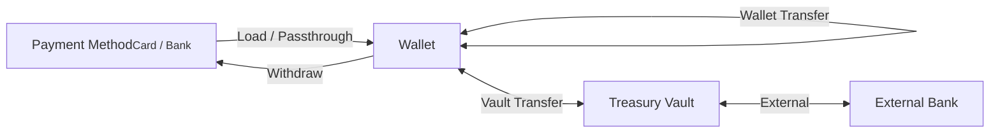
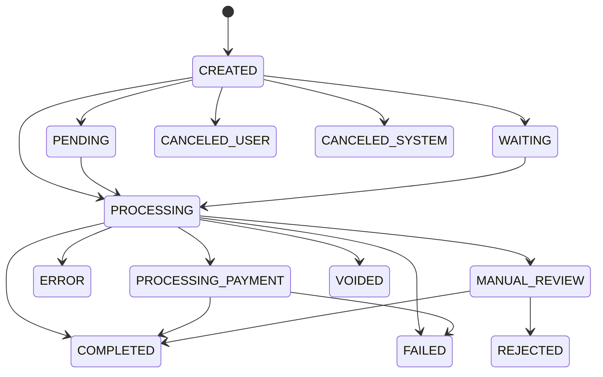

# Transactions Overview

A transaction represents a single financial operation or movement of funds on the HIVE Platform. Alviere captures every monetary action as a transaction, whether that's loading funds, a card purchase, a transfer, or a fee, so you have an auditable record of where money came from and where it went.

## Transaction scopes

Transactions exist in three scopes depending on where the funds move:

| Scope | Description |
|-------|-------------|
| **Wallet** | Tracks money in and out on a wallet's ledger |
| **Passthrough** | Child transactions that fund a parent transaction directly from a payment method (e.g. card → international transfer), without touching the wallet ledger |
| **Vault** | Transfers between wallets and treasury vaults, or between vaults and external banks |

## Statuses

| Status | Description |
|--------|-------------|
| `CREATED` | Transaction initialized |
| `PROCESSING` | In progress. A ledger transaction requiring a payment action |
| `PROCESSING_PAYMENT` | Funds being sourced from a payment method (e.g. card) |
| `COMPLETED` | Funds successfully transferred |
| `FAILED` | Could not process (e.g. declined card) |
| `ERROR` | A system anomaly prevented processing |
| `CANCELED_USER` | Halted by customer or agent via Portal |
| `CANCELED_SYSTEM` | Canceled by an automated system rule |
| `VOIDED` | Nullified before payment execution. No debit or credit occurred |
| `PENDING` | Awaiting customer action or fund settlement |
| `MANUAL_REVIEW` | Under review by Alviere's compliance and risk team |
| `WAITING` | On standby for wallet balance availability or prefunding vault input |
| `REJECTED` | Declined after manual review by risk/fraud |

## Transaction types

There are 47 transaction types. You will never handle all of them: your program's modules determine which ones you can actually produce. What matters when you build is knowing which types you originate yourself, which ones Alviere posts on your behalf, and which ones can show up unannounced days after the fact.

Nine of the 47 never appear on a wallet ledger. They exist at the vault or passthrough scope, so if you are reading `GET /wallets/{wallet_uuid}/transactions` you will not see them. Read `GET /transactions` instead.

### Money in

| Type | What creates it | Wallet scope |
|---|---|---|
| `LOAD_FUNDS` | `POST /wallets/{wallet_uuid}/load`. Pulls from a saved card or bank payment method | Yes |
| `CASH_LOADING` | A barcode redeemed at a retail location | Yes |
| `CHECK_DEPOSIT` | `POST /wallets/{wallet_uuid}/check-deposits` | Yes |
| `BANK_DEBIT` | An ACH debit against a payer's bank account | Yes |
| `PAYMENT` | A V3 acceptance charge, card or ACH | Yes |
| `INTERNATIONAL_TRANSFER` | `POST /wallets/{wallet_uuid}/remittances` | Yes |
| `INSTANT_BANK_TRANSFER` | An instant-rail bank transfer | Yes |
| `INSTANT_PAYMENT_REQUEST` | A request for payment on an instant rail | Yes |
| `PREFUND` | The prefunding vault advancing funds before settlement | No |

### Money out

| Type | What creates it | Wallet scope |
|---|---|---|
| `WITHDRAW_FUNDS` | `POST /wallets/{wallet_uuid}/withdraw` to an external card or bank | Yes |
| `BANK_CREDIT` | An ACH credit pushing funds to an external bank | Yes |
| `CHECK_DISBURSEMENT` | A check issued out of a wallet | Yes |
| `EXTERNAL_CREDIT`, `EXTERNAL_DEBIT` | Movement between a treasury vault and the external bank behind it | No |

### Transfers

| Type | What creates it | Wallet scope |
|---|---|---|
| `WALLET_TRANSFER` | Movement between two wallets on the same program | Yes |
| `TRANSFER` | `POST /treasury/transfer` between treasury vaults | Yes |

### Reversals and money coming back

These are the ones that arrive late. Every one of them carries `parent_transaction_uuid` pointing at the transaction it undoes, and every one of them can land after you have already delivered value.

| Type | What creates it | Wallet scope |
|---|---|---|
| `RETURN` | The payer's bank returning an ACH debit. Carries `type_details.ach_payment_details.return_code` | Yes |
| `CHECK_DEPOSIT_RETURN` | A deposited check coming back unpaid | Yes |
| `REFUND` | `POST /transactions/{transaction_uuid}/refund` | Yes |
| `REVERSAL` | `POST /transactions/{transaction_uuid}/reverse` | Yes |
| `CHARGEBACK` | A cardholder disputing a charge through their issuer | Yes |
| `LOAD_PULLBACK` | A completed load being pulled back | Yes |

### Fees and incentives

| Type | What creates it | Wallet scope |
|---|---|---|
| `SERVICE_FEE` | A configured fee rule firing on a transaction | Yes |
| `SERVICE_FEE_REVERSAL` | `POST /wallets/{wallet_uuid}/service-fees/{transaction_uuid}/reverse` | Yes |
| `CASHBACK` | A cashback incentive rule paying out from the Promo Funds vault | Yes |
| `BOOST` | A boost incentive rule crediting balance at authorization | Yes |

### Issued cards

Every one of these is posted by Alviere in response to network activity. You do not originate them.

| Type | Meaning |
|---|---|
| `CARD_ISSUED_DEBIT` | A purchase on an issued card |
| `CARD_ISSUED_ATM_DEBIT` | An ATM withdrawal |
| `CARD_ISSUED_OTC_DEBIT` | An over-the-counter cash withdrawal |
| `CARD_ISSUED_CREDIT` | A credit back to the card, such as a merchant refund |
| `CARD_ISSUED_TERMINAL_CREDIT` | A credit originated at a terminal |
| `CARD_ISSUED_DISPUTE_DEBIT` | Funds removed while a dispute is open |
| `CARD_ISSUED_DISPUTE_CREDIT` | Funds returned when a dispute resolves in the cardholder's favor |
| `CARD_ISSUED_FEE` | A fee charged against the card |
| `CARD_ISSUED_INITIAL` | The initial load at issuance |
| `CARD_ISSUED_REISSUE` | A reissue, same PAN with a new expiry |
| `CARD_ISSUED_ADJUSTMENT`, `CARD_ISSUED_RESET` | Corrections posted by the issuing platform |

### Passthrough

Passthrough transactions fund a parent transaction straight from a payment method without the money ever landing in the wallet ledger. You see them as children of the parent, not as wallet activity.

| Type | Funds the parent from | Wallet scope |
|---|---|---|
| `CARD_PASSTHROUGH` | A card payment method | No |
| `BANK_PASSTHROUGH` | A bank payment method | No |
| `REFUND_PASSTHROUGH` | Refunding a passthrough-funded parent | No |

### Platform and ledger operations

| Type | Meaning | Wallet scope |
|---|---|---|
| `ACH_PRENOTE` | A zero-dollar ACH entry that validates a bank account before live debits run against it | No |
| `ADJUSTMENT` | A manual ledger correction | Yes |
| `TRANSIT_TRANSFER` | Movement of funds through the transit bucket | No |
| `INTERNAL_CREDIT` | An internal credit posted by the platform | No |
| `NEGATIVE_LOSS` | A negative balance written off against the program's loss reserve | Yes |
| `RECOVERY` | Funds recovered against a previously written-off balance | Yes |

:::scalar-callout{type="warning"}
Do not switch on `transaction_type` alone when deciding whether money moved in or out. Check the sign of `amount`: returns, reversals, and dispute debits post as negative amounts against the same wallet.
:::

Per-type fields live under `type_details`, a discriminated object keyed on the transaction type.

Neither `GET /transactions` nor `GET /wallets/{wallet_uuid}/transactions` filters on `transaction_type` today. Both filter on `account_uuid`, `wallet_uuid`, `beneficiary_uuid`, `issued_card_uuid`, and `payment_method_uuid` only, so filtering by type means pulling the page and filtering client-side.
