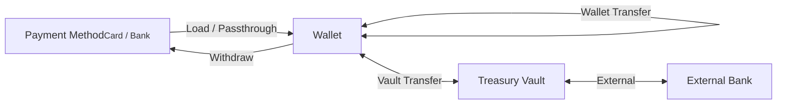
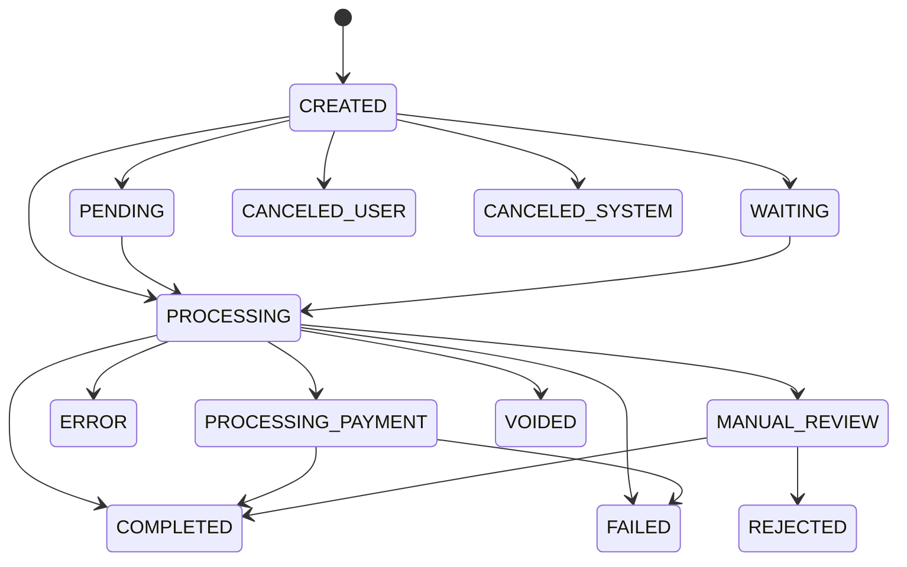

# Transactions Overview

A transaction represents a single financial operation or movement of funds on the HIVE Platform. Every monetary action — loading funds, card purchases, transfers, fees — is captured as a transaction so you have an auditable record of where money came from and where it went.

## Transaction scopes

Transactions exist in three scopes depending on where the funds move:

| Scope | Description |
|-------|-------------|
| **Wallet** | Tracks money in and out on a wallet's ledger |
| **Passthrough** | Child transactions that fund a parent transaction directly from a payment method (e.g. card → international transfer), without touching the wallet ledger |
| **Vault** | Transfers between wallets and treasury vaults, or between vaults and external banks |

## Statuses

| Status | Description |
|--------|-------------|
| `CREATED` | Transaction initialized |
| `PROCESSING` | In progress — a ledger transaction requiring a payment action |
| `PROCESSING_PAYMENT` | Funds being sourced from a payment method (e.g. card) |
| `COMPLETED` | Funds successfully transferred |
| `FAILED` | Could not process (e.g. declined card) |
| `ERROR` | A system anomaly prevented processing |
| `CANCELED_USER` | Halted by customer or agent via Portal |
| `CANCELED_SYSTEM` | Canceled by an automated system rule |
| `VOIDED` | Nullified before payment execution — no debit or credit occurred |
| `PENDING` | Awaiting customer action or fund settlement |
| `MANUAL_REVIEW` | Under review by Alviere's compliance and risk team |
| `WAITING` | On standby for wallet balance availability or prefunding vault input |
| `REJECTED` | Declined after manual review by risk/fraud |

## Transaction types

:::scalar-callout{type="info"}
The full reference of transaction types — load, withdraw, P2P, card purchase, international transfer, check deposit, and more — is being expanded here. See the [V2 API Reference](/api-v2) or [V3 API Reference](/api-v3) for the current list and per-type fields.
:::
