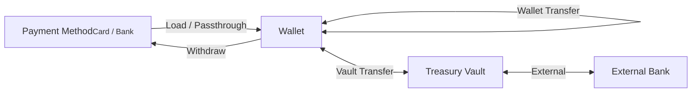
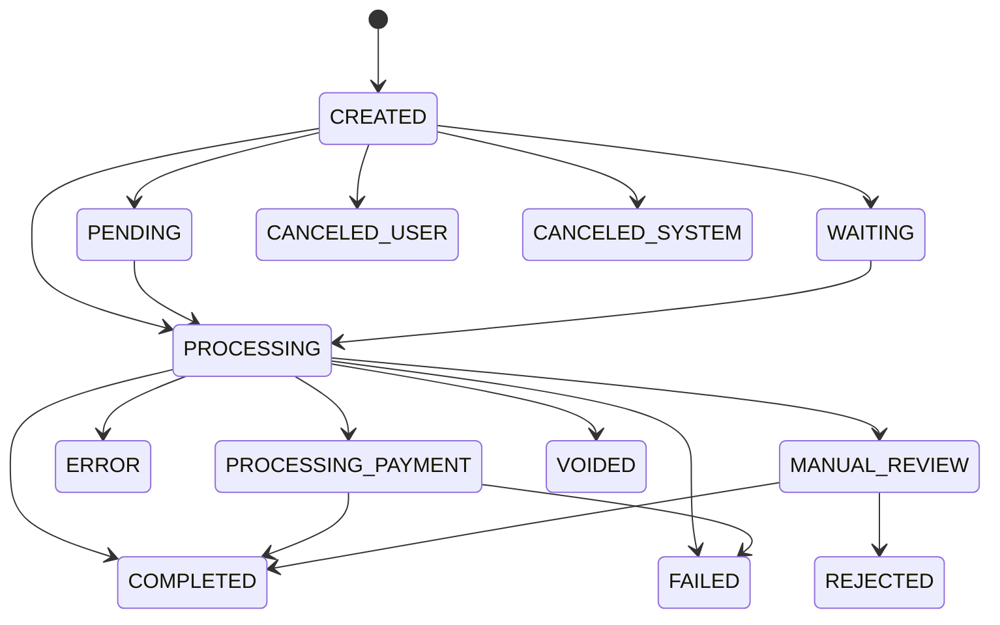

# Transactions Overview

Every movement of money on Alviere is a transaction. A card charge, a payout to a bank account, a fee deducted from a sale, and a chargeback weeks later are each one record with a UUID, a type, a status, and a signed amount. Fees and refunds link to the transaction they act on through `parent_transaction_uuid`, so you can walk from any record to the ones it caused.

## Transaction scopes

A transaction lives in one of three scopes, depending on which ledgers the money touches.



| Scope | What it records |
|-------|-------------|
| Wallet | Money moving in or out of a wallet. This is where almost everything you originate lands |
| Passthrough | A child transaction that funds its parent straight from a payment method. A card-funded international transfer has a `CARD_PASSTHROUGH` child and a bank-funded one a `BANK_PASSTHROUGH` child. The wallet ledger never sees the money |
| Vault | Movement between wallets and treasury vaults, or between a vault and the external bank behind it |

## Statuses



| Status | Description |
|--------|-------------|
| `CREATED` | The record exists and nothing has moved yet |
| `PROCESSING` | Alviere is working the transaction |
| `PROCESSING_PAYMENT` | Alviere is pulling funds from the payment method, such as a card authorization in flight |
| `COMPLETED` | The money moved. Final |
| `FAILED` | The money did not move, for example a declined card. Final. Read `status_reason` for why |
| `ERROR` | A fault on Alviere's side stopped it. Final. Raise it with support rather than retrying blindly |
| `CANCELED_USER` | Your customer or one of your agents canceled it before it ran |
| `CANCELED_SYSTEM` | A rule on your program canceled it before it ran |
| `VOIDED` | An authorization released before capture. Nothing was debited or credited |
| `PENDING` | Waiting on the customer, such as a 3-D Secure challenge, or on funds to settle |
| `MANUAL_REVIEW` | Alviere's risk team is looking at it. It will end in `COMPLETED` or `REJECTED` |
| `WAITING` | Waiting for the wallet balance or the prefunding vault to cover it |
| `REJECTED` | Declined out of manual review. Final |

## Transaction types

The API reference enumerates 47 transaction types, and `WIRE_TRANSFER` is a real one it currently omits. Your program's modules decide which of them you can produce, so you will handle a fraction. What matters when you build is knowing which types you originate yourself, which ones Alviere posts on your behalf, and which ones can show up unannounced days after the fact.

Nine of them never appear on a wallet ledger. They exist at the vault or passthrough scope, so if you are reading `GET /wallets/{wallet_uuid}/transactions` you will not see them. Read `GET /transactions` instead.

### Types are operations, not rails

A transaction type tells you what operation happened. It does not tell you which rail carried the money. The two are independent, and there is no `ACH` transaction type because ACH is not an operation.

ACH shows up under whichever type matches the operation:

| Type | The ACH operation |
|---|---|
| `LOAD_FUNDS` | Pull. Debits a bank account to fund a wallet |
| `BANK_DEBIT` | Push. Pays a beneficiary's bank payout method |
| `PAYMENT` | Pull. What `POST /v3/ach/debit` creates |
| `WITHDRAW_FUNDS` | Push. Credits an external bank account |
| `REFUND` | Sometimes, when the refund goes back over ACH |
| `RETURN` | The payer's bank sending a pull back |

So an ACH debit created through `POST /v3/ach/debit` lands in your ledger as a `PAYMENT`, not as anything named ACH. If you are reconciling ACH volume, filtering for a single type will undercount it.

The same logic runs the other way. `LOAD_FUNDS` and `WITHDRAW_FUNDS` are not ACH-only, since both also carry card. The type is the operation. Check `type_details` for the rail.

The sandbox return simulator, `POST mock.snd.alviere.com/generateReturn`, accepts exactly `LOAD_FUNDS`, `PAYMENT`, `WITHDRAW_FUNDS`, and `BANK_DEBIT`, because those are the pulls and pushes that ACH can return. See [Pay by Bank](/guides/payment-acceptance/online-payments/pay-by-bank/introduction).

### Money in

| Type | What creates it | Wallet scope |
|---|---|---|
| `LOAD_FUNDS` | `POST /wallets/{wallet_uuid}/load`. Pulls from a saved card or bank payment method | Yes |
| `CASH_LOADING` | A barcode redeemed at a retail location | Yes |
| `CHECK_DEPOSIT` | `POST /wallets/{wallet_uuid}/check-deposits` | Yes |
| `BANK_CREDIT` | An incoming ACH credit from an external bank account | Yes |
| `INSTANT_BANK_TRANSFER` | An incoming instant payment over FedNow or TCH RTP, paid against a request. See [Instant Payments](/guides/transactions/instant-payments) | Yes |
| `INSTANT_PAYMENT_REQUEST` | `POST /v3/instant/request`. The request for payment itself, with an `expires_at`. The money arrives as the `INSTANT_BANK_TRANSFER` above | Yes |
| `PAYMENT` | A V3 acceptance charge. Both `POST /v3/cards/debit` and `POST /v3/ach/debit` create one | Yes |
| `PREFUND` | The prefunding vault advancing funds before settlement | No |

### Money out

| Type | What creates it | Wallet scope |
|---|---|---|
| `WITHDRAW_FUNDS` | `POST /wallets/{wallet_uuid}/withdraw` to an external card or bank | Yes |
| `BANK_DEBIT` | `POST /wallets/{wallet_uuid}/transfer` to a beneficiary's bank payout method | Yes |
| `INTERNATIONAL_TRANSFER` | `POST /wallets/{wallet_uuid}/remittances` to an international beneficiary | Yes |
| `CHECK_DISBURSEMENT` | A check issued out of a wallet | Yes |
| `INSTANT_BANK_TRANSFER` | `POST /v3/instant/transfer` over FedNow or TCH RTP. Pushes funds out of a wallet. See [Instant Payments](/guides/transactions/instant-payments) | Yes |
| `EXTERNAL_CREDIT`, `EXTERNAL_DEBIT` | Movement between a treasury vault and the external bank behind it | No |

### Internal transfers

| Type | What creates it | Wallet scope |
|---|---|---|
| `WALLET_TRANSFER` | Movement between two wallets on the same program | Yes |
| `TRANSFER` | Internal vault movement: `POST /treasury/transfer` between treasury vaults, or `POST /wallets/{wallet_uuid}/credit` and `/debit` moving funds between a wallet and the Operations, Promo Funds, or Providers vault | Yes |

### Reversals and money coming back

These arrive late, sometimes weeks after the transaction they undo, and often after you have already delivered value. Each carries `parent_transaction_uuid` pointing at that transaction.

| Type | What creates it | Wallet scope |
|---|---|---|
| `RETURN` | The payer's bank sending an ACH debit back. Carries `type_details.ach_payment_details.return_code` | Yes |
| `CHECK_DEPOSIT_RETURN` | A deposited check coming back unpaid | Yes |
| `REFUND` | `POST /v3/cards/reverse` against a captured card charge, or `POST /payments/refund` against a V2 payment. Refunds of an uncaptured authorization void the parent instead and create nothing. A refund of a cash-funded transaction, such as a cash remittance, sits in `PENDING` until you set how the customer gets the money back with `PUT /transactions/{transaction_uuid}/refund`, either `CASH` or `CHECK` | Yes |
| `REVERSAL` | `POST /transactions/{transaction_uuid}/reverse`. Only for `SERVICE_FEE`, `CASHBACK`, `CARD_ISSUED_INITIAL`, and card-funded `LOAD_FUNDS` | Yes |
| `CHARGEBACK` | A cardholder disputing a charge through their issuer | Yes |
| `LOAD_PULLBACK` | A completed load being pulled back | Yes |

### Fees and incentives

| Type | What creates it | Wallet scope |
|---|---|---|
| `SERVICE_FEE` | A configured fee rule firing on a transaction | Yes |
| `SERVICE_FEE_REVERSAL` | `POST /wallets/{wallet_uuid}/service-fees/{transaction_uuid}/reverse` | Yes |
| `CASHBACK` | A cashback incentive rule paying out from the Promo Funds vault | Yes |
| `BOOST` | A boost incentive rule crediting balance at authorization | Yes |

### Issued cards

Alviere posts all of these in response to card network activity. You do not originate them.

| Type | Meaning |
|---|---|
| `CARD_ISSUED_DEBIT` | A purchase on an issued card |
| `CARD_ISSUED_ATM_DEBIT` | An ATM withdrawal |
| `CARD_ISSUED_OTC_DEBIT` | An over-the-counter cash withdrawal |
| `CARD_ISSUED_CREDIT` | A credit back to the card, such as a merchant refund |
| `CARD_ISSUED_TERMINAL_CREDIT` | A credit originated at a terminal |
| `CARD_ISSUED_DISPUTE_DEBIT` | Funds removed while a dispute is open |
| `CARD_ISSUED_DISPUTE_CREDIT` | Funds returned when a dispute resolves in the cardholder's favor |
| `CARD_ISSUED_FEE` | A fee charged against the card |
| `CARD_ISSUED_INITIAL` | The initial load at issuance |
| `CARD_ISSUED_REISSUE` | A reissue, same PAN with a new expiry |
| `CARD_ISSUED_ADJUSTMENT`, `CARD_ISSUED_RESET` | Corrections posted by the issuing platform |

### Passthrough

Passthrough transactions fund a parent transaction straight from a payment method without the money ever landing in the wallet ledger. You see them as children of the parent, not as wallet activity.

| Type | Funds the parent from | Wallet scope |
|---|---|---|
| `CARD_PASSTHROUGH` | A card payment method | No |
| `BANK_PASSTHROUGH` | A bank payment method | No |
| `REFUND_PASSTHROUGH` | Refunding a passthrough-funded parent | No |

### Platform and ledger operations

| Type | Meaning | Wallet scope |
|---|---|---|
| `ACH_PRENOTE` | A zero-dollar ACH entry that validates a bank account before live debits run against it | No |
| `ADJUSTMENT` | A manual ledger correction | Yes |
| `TRANSIT_TRANSFER` | Movement of funds through the transit bucket | No |
| `INTERNAL_CREDIT` | An internal credit posted by the platform | No |
| `NEGATIVE_LOSS` | A negative balance written off against the program's loss reserve | Yes |
| `RECOVERY` | Funds recovered against a previously written-off balance | Yes |

:::scalar-callout{type="warning"}
Do not switch on `transaction_type` alone when deciding whether money moved in or out. Check the sign of `amount`: returns, reversals, and dispute debits post as negative amounts against the same wallet.
:::

Per-type fields live under `type_details`, a discriminated object keyed on the transaction type.

Both list endpoints filter by transaction type server-side, through a query parameter named `type`. The response field is `transaction_type`, and the mismatch is easy to grep past. `type` takes any of the 38 wallet-scope types, comma-separated for multiples:

```
GET /transactions?type=LOAD_FUNDS,WITHDRAW_FUNDS
```

Combine it with `status`, `start_date` and `end_date`, and the entity filters (`account_uuid`, `wallet_uuid`, `beneficiary_uuid`, `issued_card_uuid`, `payment_method_uuid`).

The `type` enum covers only the wallet-scope list. The vault- and passthrough-scope types from the tables above are not filterable this way. That includes `PREFUND`, `ACH_PRENOTE`, the passthrough family, and the treasury movements. If you need those, read `GET /transactions` without a type filter and match on `transaction_type` in the response.
