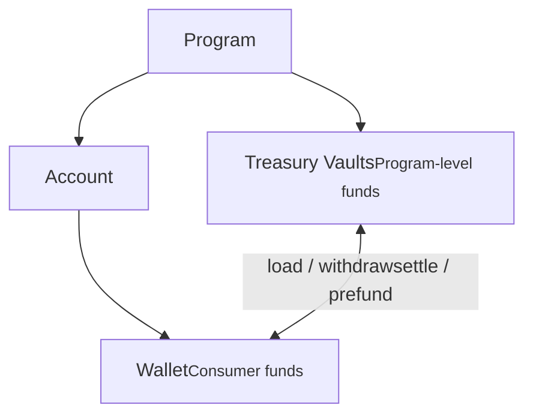

# Treasury Vaults

Treasury vaults are program-level entities that act as both a ledger and an underlying bank account managed by your company. They power the fund flows behind each financial module in your program: prefunding consumer wallets, holding loss reserves, settling card transactions, collecting fees, and so on.

Each vault type can be linked to specific payment methods (typically bank accounts via ACH, but also credit or debit cards) for loading and withdrawing funds.

:::scalar-callout{type="info"}
You'll manage treasury vaults through Alviere's Portal under "Treasury Management." Access is usually restricted to users with Finance profiles.
:::

## Vault types

| Vault type | Purpose | Notes |
|-----------|---------|-------|
| **Card Funding** | Just-in-time funding (e.g. gift card programs) | Funds belong to your program, not end customers, until used |
| **Loss Reserve** | Reserve for potential program losses like chargebacks | — |
| **Service Fees** | Holds service fees charged to consumers | Fees can be reversed back to consumer wallets |
| **Prefunding** | Provides temporary funds to consumers before settlement | — |
| **Card Settlements** | Receives settled funds from Alviere's payment processor | — |
| **Promo Funds** | Holds promotional funds (cashbacks, boosts) | Card issuance program incentives pull from here |
| **International Transit** | Supports international transactions in the Global Money Transfers module | Funds must be moved here to fulfill international transactions |
| **Operations** | Program-owned vault for loading and withdrawing from end-customer wallets | — |
| **Providers** | Separates provider fund access from the Operations vault | For programs whose providers need direct fund access |
| **FX Reserve** | Reserve for currency exchange fluctuations | Also handles exchange markups or losses |

## How vaults relate to wallets

Vaults sit at the **program** level and hold and move funds on behalf of the program itself. Consumer wallets sit at the **account** level and hold funds belonging to your end customers. Fund flows between the two are what make operations like prefunding, fee collection, and settlement possible.
