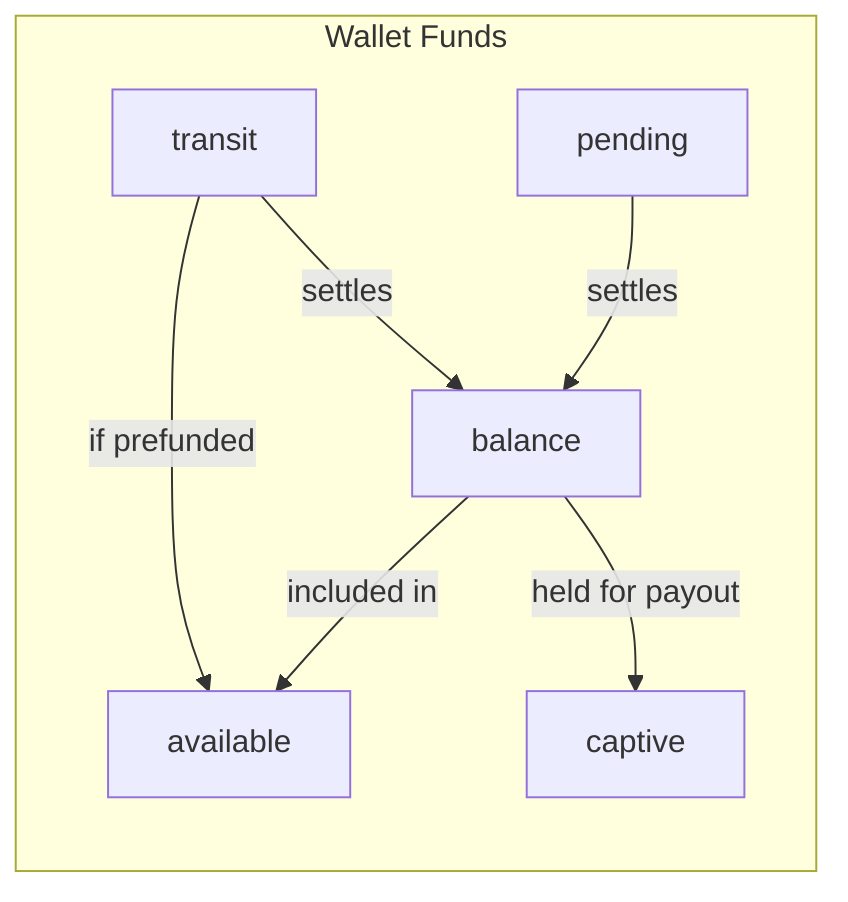

# Wallets

A wallet is the core ledger on an account. It tracks balances, money in and out, and what the account holder can spend. Each account can have one or more wallets.

## What you can do with a wallet

- **Move money between wallets**. Between the same account or to a different account holder.
- **Send to an external bank**. Withdraw to a connected bank account.
- **Load funds in**. Deposit from a saved payment method.
- **Fund issued cards**. Back card spending with the wallet balance.

## Wallet types

| Type | Description |
|------|-------------|
| `CHECKING` | Flexible wallet for everyday transactions |
| `PREPAID` | Preloaded with a set amount for specific spending limits |
| `PREPAID_NON_RELOADABLE` | Single-load wallet. Cannot be reloaded after the initial amount is spent |
| `SAVINGS` | Long-term fund storage that generates yield over time |
| `PASSTHROUGH` | Passthrough wallet for remittance-only profiles |

## Fund buckets

The `funds` object on a wallet breaks the financial state into five buckets. You'll work with these when displaying balances or reconciling activity:

### Available

Total funds (in cents) the consumer can use right now.

| Program type | Calculation |
|-------------|-------------|
| With prefunding | `balance` + `transit` |
| Without prefunding | `balance` only |

### Balance

Settled funds in the wallet (in cents). These exist in the underlying bank account and are fully processed.

### Transit

Unsettled funds (in cents) from authorized but not-yet-settled transactions. **Counted as available** because they're prefunded. Moves to `balance` once settlement clears.

### Pending

Unsettled funds (in cents), similar to transit. **Not counted as available** since they're not prefunded. Moves to `balance` once settled.

### Captive

Funds held (in cents) for outgoing transactions that have been executed but not yet settled.
